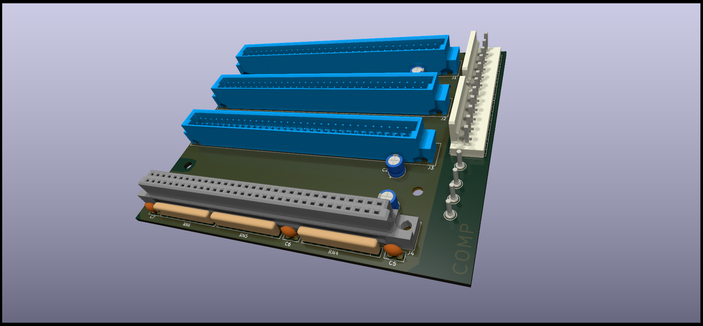
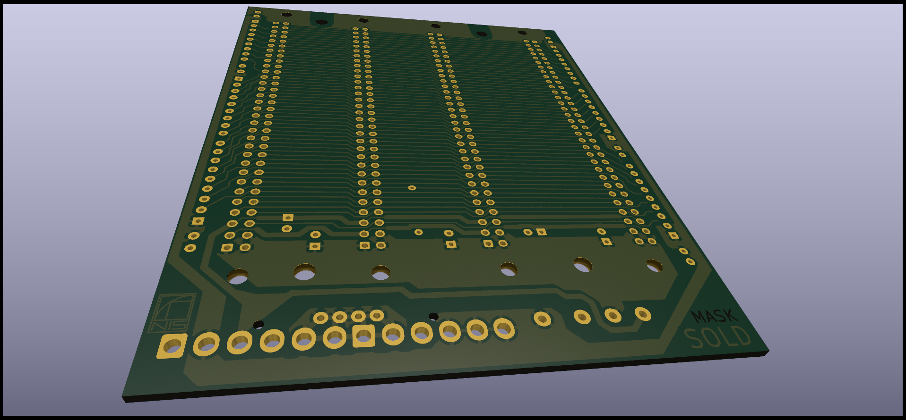

# QPLANE - SINCLAIR QL Backplane port expansion.

(C) 2023 Alvaro Alea Fernandez

License under: CERN Open Hardware Licence Version 2 - Strongly Reciprocal

https://ohwr.org/cern_ohl_s_v2.txt

This board has been reverse engineered from pictures freely available on internet.

THIS BOARD HAS NOT BEEN TESTED!! Use at your own risk.

##Information

This backplane is intended for install the QL main board in a PC AT case.

* Provide 3 expansion slot, this slot has the oposite direction of insert.
* Get energy from tipical AT power supply, for that is need to remove the regulator in the QL
* This cause that microdrive do not work, 
* This also cause that board of expansion need to be modified to adapt to the new voltages. 

 

 

